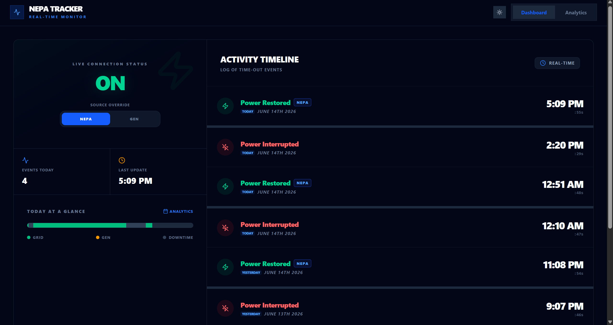
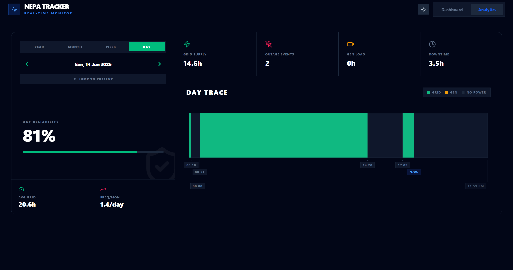
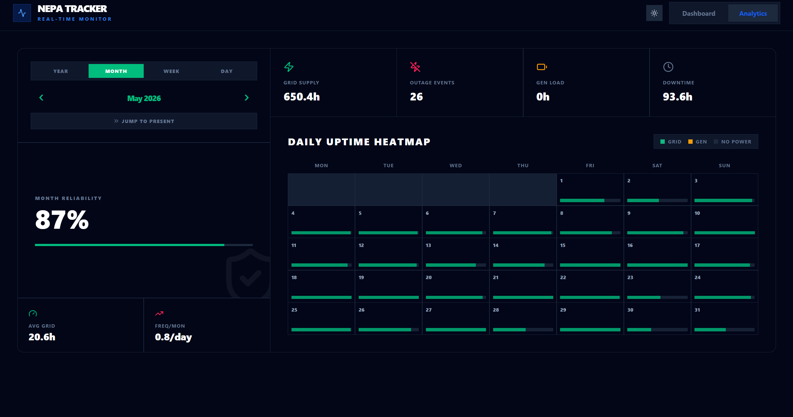
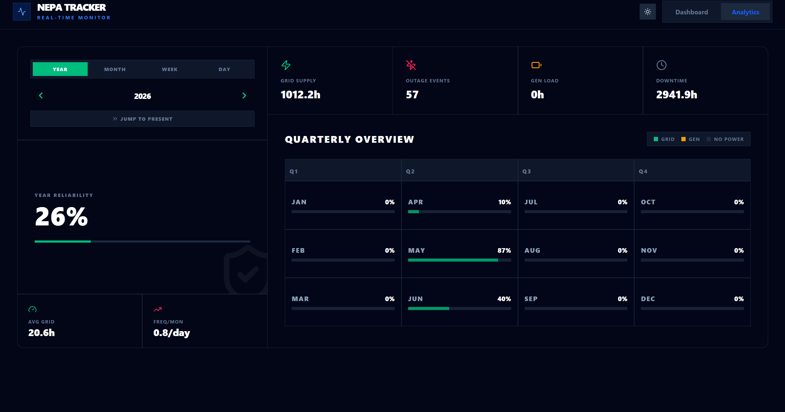

# NEPA Tracker

A full-stack IoT monitoring system built to track power availability and source transitions in real-time. Designed specifically for the Nigerian energy landscape to provide transparent, historical data on Grid (NEPA) versus Generator uptime.

  

## 🏗️ Architecture & Tech Stack

This project bridges hardware and the cloud using a modern, decoupled stack:

* **Frontend:** React (Vite) + Tailwind CSS + Recharts for real-time analytics and heatmaps.
* **Backend:** FastAPI (Python) for handling high-frequency hardware telemetry.
* **Database:** Supabase (PostgreSQL) for persistent event logging and uptime calculations.
* **Hardware:** ESP32 Microcontroller (C++) acting as the localized sensor.
* **Alerting:** Telegram Bot API for instant push notifications on state changes.

## ⚙️ How It Works — The Dead Man's Switch

Rather than relying on a microcontroller to send a "Power Off" signal — which is unreliable when power is lost — this system uses a **Dead Man's Switch** architecture:

1. **The Heartbeat:** An ESP32 plugged directly into a wall outlet sends a continuous "ping" to the FastAPI backend every 60 seconds.
2. **The Trigger:** If the backend fails to receive a ping within that ~60-second window, the server actively assumes a power outage.
3. **The Action:** The server logs the exact estimated time of death to the database, switches the live dashboard state to `OFF`, and pushes an outage alert to Telegram.
4. **Source Logging:** When power returns, the system logs the restoration and allows for manual or automated overrides to specify the source — Grid vs. Generator.

## 🚀 Features

* **Live Sync Dashboard:** Continuous telemetry monitoring displaying current power status and historical uptime with minute-level precision.
* **Historical Timeline:** A complete archive of every power event with microsecond database precision.
* **Analytics Engine:** Daily traces, weekly heatmaps, and continuous uptime KPI tracking.
* **UTC-Synchronized:** Fully UTC-compliant architecture, ensuring accurate data visualization regardless of local browser offsets.

## 📊 Analytics

### Daily Power Trace

Visualizes grid availability, generator usage, downtime, outage events, and reliability metrics for an individual day.

  

### Monthly Uptime Heatmap

Provides a calendar-style overview of daily grid availability throughout the selected month.

  

### Yearly Reliability Overview

Aggregates power reliability across the year, including quarterly and monthly availability statistics.

  

